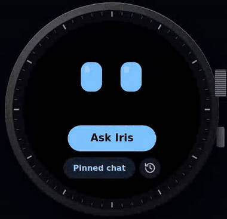
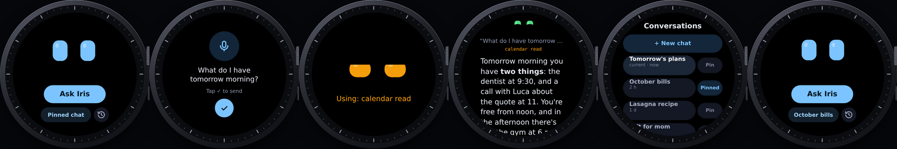
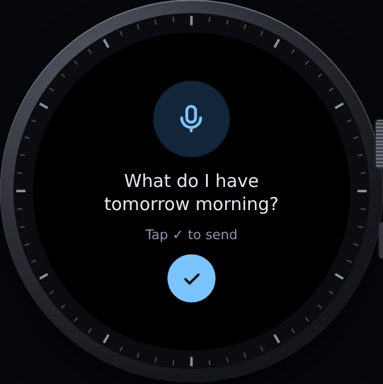
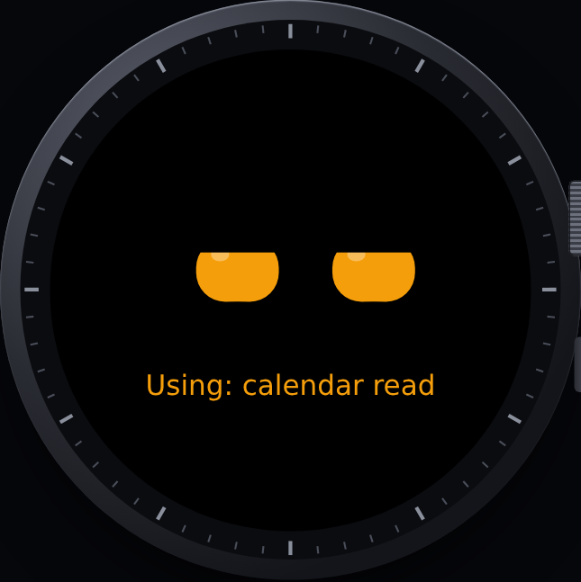
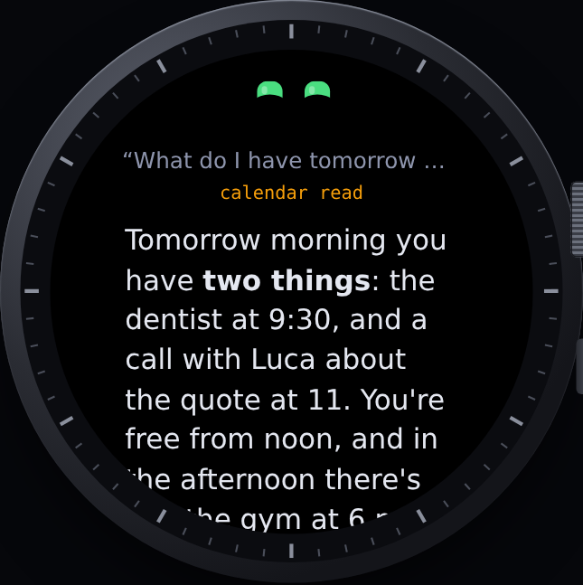
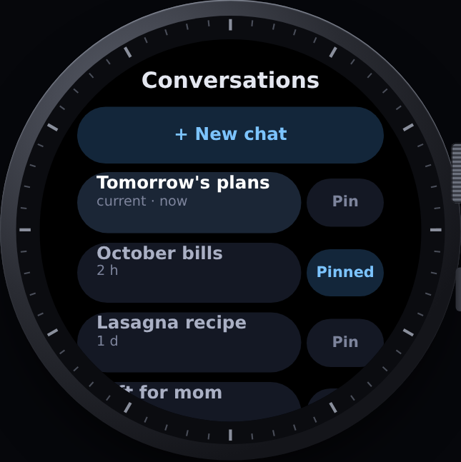

<div align="center">


# Iris Dial

**Your [Hermes agent](https://github.com/NousResearch/hermes-agent) on your wrist.**

Iris' animated eyes and a chat with Hermes on the **Amazfit Balance 2** (Zepp OS, round 480×480 screen).<br>
Dictate a question · watch the eyes think · read the reply with the crown.

[**Website**](https://mark9712seto.github.io/IrisDial/) · [**▶ Interactive prototype**](https://mark9712seto.github.io/IrisDial/demo.html) · [**Install guide**](docs/install.md) · [Releases](../../releases)



<sub>Early version 0.1 · free for non-commercial use · sister project of <a href="https://github.com/Mark9712Seto/IrisNotch">Iris Notch</a> · <a href="#italiano">italiano più sotto ↓</a></sub>

</div>

---

> **Status: test version 0.1.3.** It's here to prove the idea works end to end: question on the watch → phone → tunnel → Hermes → answer on the wrist. The watch interface is in Italian for now.



<sub>From the home screen to the reply: dictation, Iris using a tool, the reply read with the crown, history with the pinned chat. Images from the <a href="https://mark9712seto.github.io/IrisDial/demo.html">prototype</a>, with made-up answers.</sub>

## An example conversation

| | On the watch |
|---|---|
|  | Press **Ask Iris** (a new chat) and dictate: *“What do I have tomorrow morning?”*, then ✓. |
|  | The eyes turn orange and the tool Iris is using appears below: *calendar*. |
|  | The watch buzzes and shows the reply: *“Tomorrow morning you have two things: the dentist at 9:30, and a call with Luca about the quote at 11…”*. Scroll with the crown; at the end, **Continue** and **New chat**. |
|  | **History** (the round clock button): Hermes' latest conversations, including the ones started on Telegram or on your PC. Tap one to continue it, or **Pin** it to the *Pinned chat* button on the home screen. |

The real answers are written by your Hermes Agent, with its own tools (calendar, mail, home…).

## What it does

- **Iris' eyes**, which blink and change color while Iris works: thinking, using a tool (with its name), answering, error.
- **Ask Iris**: dictate the question with the watch's voice keyboard, or type it.
- **Three buttons**: *Ask Iris* (new chat), your *pinned chat* to pick it up quickly and, next to it, the round *history* button (Telegram and Iris Notch conversations too). At the end of each reply, *Continue* stays in the same conversation.
- **Full-screen eyes while Iris works**, with the screen kept on until the reply (even several minutes, with *Keep waiting*).
- **Connection test** from the watch and from the settings in the Zepp app, with clear errors (Cloudflare token, Hermes key, Hermes needs updating).

## How it's connected

```
Watch ──Bluetooth──▶ Zepp app (phone) ──HTTPS──▶ Cloudflare Access ──tunnel──▶ Hermes at home
```

The keys live only in the Zepp app's settings on your phone, never on the watch. Details in [docs/architecture.md](docs/architecture.md).

## Privacy

- Iris Dial has **no servers, no account and no analytics**. Your questions go from your phone to **your own** Hermes, and nowhere else.
- **Two locks**: Cloudflare Access only lets through requests with your service token, then Hermes checks its API key. No ports open on your router.
- Dictation is done by the watch's own system keyboard.

More in [PRIVACY.md](PRIVACY.md).

## Install

Full guide: [**docs/install.md**](docs/install.md) ([italiano](docs/installazione.md)). In short:

1. Hermes with its API server, behind a [Cloudflare tunnel](docs/cloudflare-tunnel.md) with a service token.
2. Zepp app → Profile → Settings → About → tap the Zepp icon **7 times** to enable Developer mode.
3. On Windows, run `tools\installa-sul-telefono.ps1` and scan the QR code from Developer mode. Run it again to update.
4. Paste the tunnel address and keys into Iris Dial's settings in the Zepp app, then **test the connection**.

## The code

| Folder | What's inside |
|---|---|
| `page/` | the watch pages: home, waiting screen, reply, history |
| `app-side/` | the part running in the Zepp app on the phone: calls to Hermes |
| `setting/` | the settings page in the Zepp app |
| `shared/` | the eyes engine for the browser prototype |
| `design/` | the interactive prototype |
| `site/` | the website, published to GitHub Pages |
| `docs/` | install guide, tunnel, architecture |

The `.zab` package is built by GitHub Actions with Zepp's official tool (`zeus build`) on every change; a manual run with **release** turned on publishes it as a Release.

## License

[PolyForm Noncommercial 1.0.0](LICENSE): free to use, modify and share for non-commercial purposes. © 2026 Variety Project.
An independent project, not affiliated with Zepp Health / Amazfit or Nous Research.

---

## Italiano

**Iris Dial** porta gli occhi di Iris e la chat con [Hermes Agent](https://github.com/NousResearch/hermes-agent) sull'**Amazfit Balance 2**. Progetto gemello di [Iris Notch](https://github.com/Mark9712Seto/IrisNotch), l'isola per Windows.

- **Chiedi a Iris**: detti la domanda con la tastiera vocale dell'orologio (o la scrivi).
- **Occhi a tutto schermo** mentre Iris pensa o usa uno strumento, schermo acceso fino alla risposta; la risposta si legge con la corona.
- **Cronologia** con le conversazioni di Hermes (anche Telegram e l'isola) e una **chat fissata** a un tocco dalla prima schermata.
- **Privacy**: niente server, account o statistiche; le chiavi restano nell'app Zepp sul telefono; doppia protezione con Cloudflare Access e la chiave di Hermes.

[Sito](https://mark9712seto.github.io/IrisDial/) · [Prova il prototipo](https://mark9712seto.github.io/IrisDial/demo.html) · [Guida all'installazione](docs/installazione.md) · [Tunnel Cloudflare](docs/cloudflare-tunnel.it.md)

**Licenza**: uso, modifiche e condivisione gratis per scopi non commerciali ([PolyForm Noncommercial 1.0.0](LICENSE)). © 2026 Variety Project.
