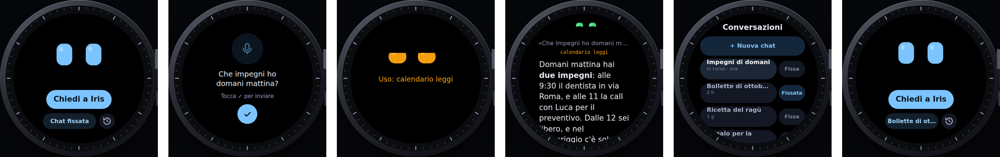
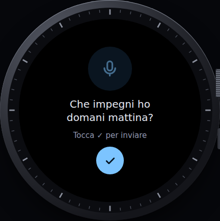
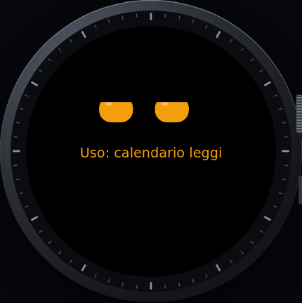
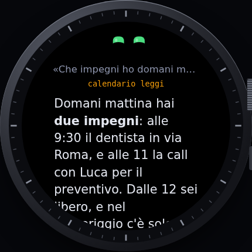
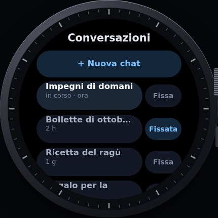

# Iris Dial

Iris al polso: gli occhi di Iris e la chat con [Hermes Agent](https://github.com/NousResearch/hermes-agent) sull'**Amazfit Balance 2** (Zepp OS, schermo rotondo 480×480).
Progetto gemello di [Iris Notch](https://github.com/Mark9712Seto/IrisNotch), l'isola per Windows.

> **Stato: versione di prova 0.1.2.** Serve a verificare che l'idea funzioni: domanda dall'orologio → telefono → tunnel → Hermes → risposta sul polso.

*Dalla prima schermata alla risposta: dettatura, Iris che usa uno strumento, risposta da leggere con la corona, cronologia con la chat fissata. Immagini dal [prototipo](design/prototipo.html) con risposte d'esempio.*

## Una conversazione d'esempio

| | Sull'orologio |
|---|---|
|  | Premi **Chiedi a Iris** (chat nuova) e detti: *«Che impegni ho domani mattina?»*, poi ✓. |
|  | Gli occhi diventano arancioni e sotto compare lo strumento che Iris sta usando: *calendario*. |
|  | L'orologio vibra e mostra la risposta: *«Domani mattina hai due impegni: alle 9:30 il dentista, e alle 11 la call con Luca per il preventivo…»*. Si legge girando la corona; in fondo **Continua** e **Nuova chat**. |
|  | **Cronologia** (il tasto tondo con l'orologio): le ultime conversazioni di Hermes, anche quelle iniziate su Telegram o sul PC. Toccane una per continuarla, oppure **Fissa** per averla nel tasto *Chat fissata* della prima schermata. |

Le risposte vere le scrive il tuo Hermes Agent, con i suoi strumenti (calendario, posta, casa…).

## Cosa fa la 0.1

- Gli occhi di Iris, che sbattono le palpebre e cambiano colore mentre pensa.
- **Chiedi a Iris:** detti la domanda con la tastiera vocale dell'orologio o la scrivi.
- **Tre tasti:** *Chiedi a Iris* (chat nuova), la *chat fissata* per riprenderla al volo e, accanto, il tasto tondo della *cronologia* (anche le conversazioni di Telegram e dell'isola). In fondo a ogni risposta, *Continua* resta nella stessa conversazione.
- **Occhi animati** che seguono il lavoro di Iris: pensa, usa uno strumento (col nome), risponde, errore.
- Lo schermo resta acceso finché arriva la risposta, che si legge scorrendo con la corona.
- **Prova collegamento** dall'orologio e dalle impostazioni nell'app Zepp, con errori spiegati (token Cloudflare, chiave di Hermes, Hermes da aggiornare).

## Come è collegato

Orologio → Bluetooth → app Zepp sul telefono → internet → tunnel Cloudflare (service token) → Hermes a casa.
Le chiavi stanno solo nelle impostazioni dell'app Zepp sul telefono, mai sull'orologio.

## Installare

[docs/installazione.md](docs/installazione.md): modalità sviluppatore dell'app Zepp, script per Windows, QR da inquadrare.
Per il tunnel: [docs/cloudflare-tunnel.md](docs/cloudflare-tunnel.md).

## Il codice

| Cartella | Cosa c'è |
|---|---|
| `page/` | le pagine sull'orologio: occhi e domanda, risposta |
| `app-side/` | la parte che gira nell'app Zepp del telefono: chiamate a Hermes |
| `setting/` | la pagina delle impostazioni nell'app Zepp |
| `design/` | demo HTML delle schermate e prototipo navigabile |
| `docs/` | installazione, tunnel, architettura |

Il pacchetto `.zab` lo compila GitHub Actions con lo strumento ufficiale di Zepp (`zeus build`) a ogni modifica; con un tag `v*` finisce in una Release.

## Licenza

[PolyForm Noncommercial 1.0.0](LICENSE): gratis da usare, modificare e condividere per scopi non commerciali. © 2026 Variety Project.
Progetto indipendente, non affiliato a Zepp Health / Amazfit né a Nous Research.
